# Sengi Gitflow

The goal of this guide is to explain all steps to accomplish gitflow focusing on Developer and the Master/Maintainer/Project Manager role.

## Requirements

- [gitmoji](https://github.com/carloscuesta/gitmoji)

## Steps

### 1. Create and empty project

The Master role create an empty repo.

### 2. :tada: First commit

The Master role create an empty README.md file and commit to the repo.

### 3. New branches

The Master role create a branch named `staging` (for testing), and another `production`.

### 4. Protect branches

Protect all branches (`master`, `staging` and `production`) from direct merge and push, you should set it up like so:

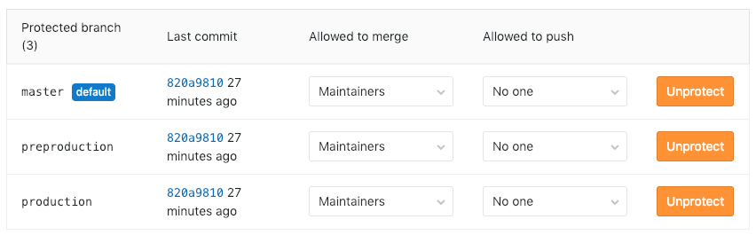

### 5. Clone the repo

Now the Developer can clone the repo.

### 6. Create a feature

The Developer creates a feature and start writing code.

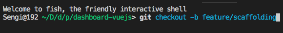
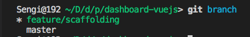

### 7. Add changes to stage

Once the Developer finished the feature, add changes to stage

### 8. Commit

The developer creates a commit using `gitmoji -c`.

### 9. Push

The Developer creates a push to the repo.

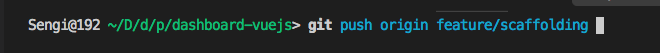

### 10. Merge Request or Pull Request

The Developer creates a Merge Request (MR) or Pull Request (PR), assigns to the Code Reviewer and delete the branch created.

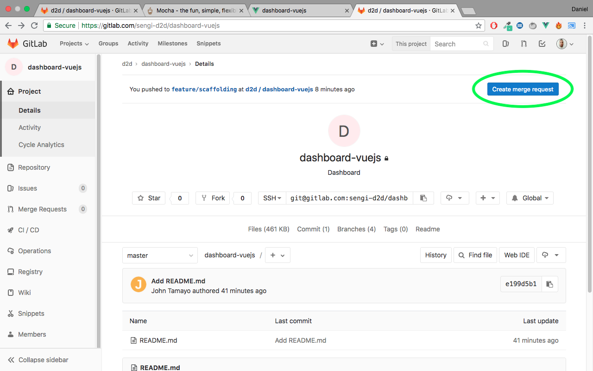
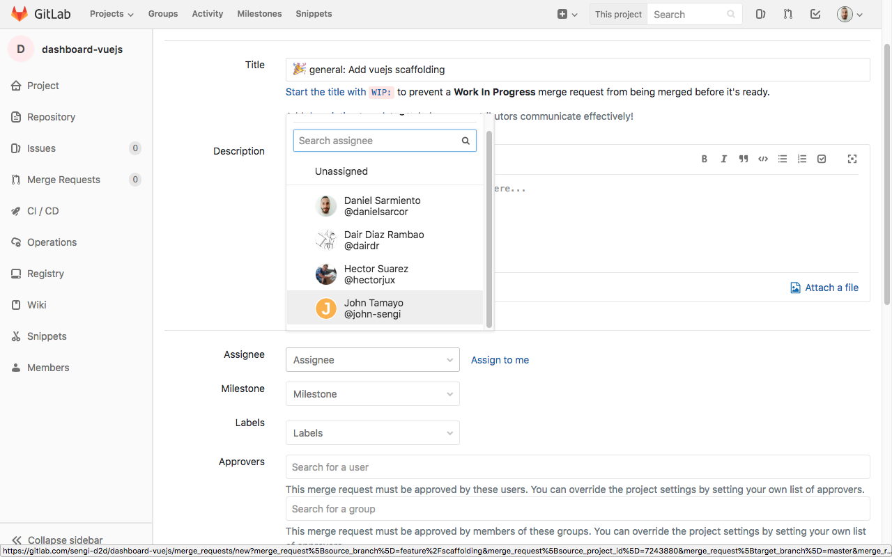
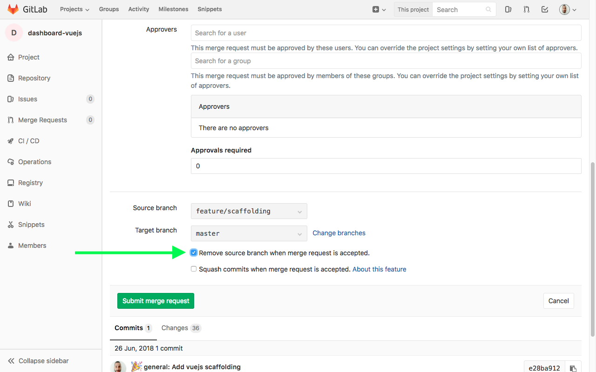
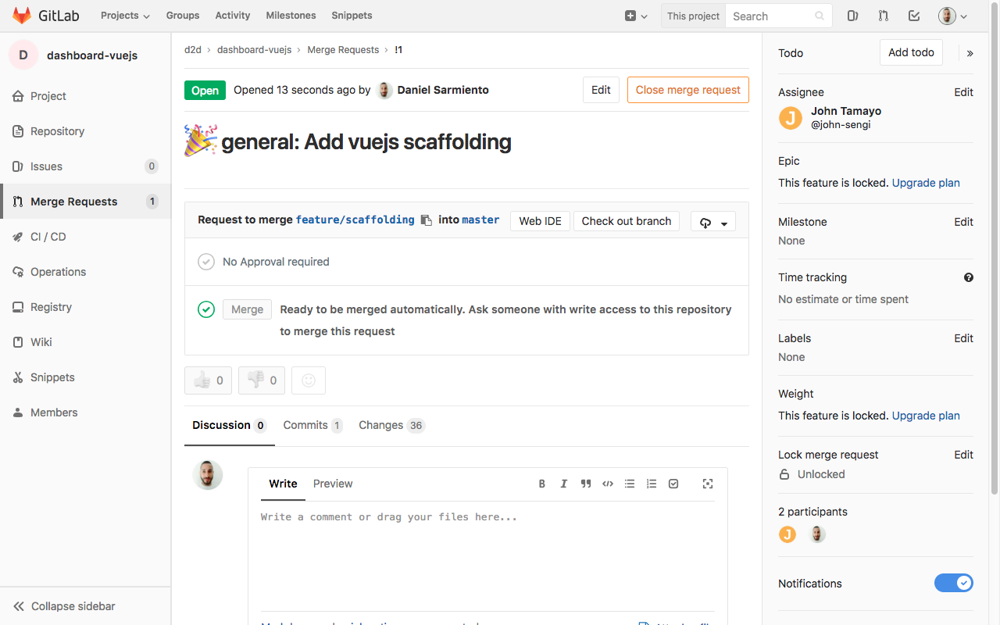

### 11. Review the commit

The Code Reviewer reviews the commit and if everything is ok, he's allowed to merge the new feature.

### 12. Finish the branch locally

After the feature is merged, the Developer should finish the feature deleting the branch and pull down all changes in the `master` branch.

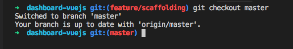
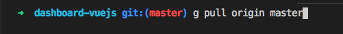
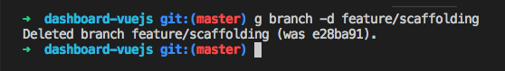
