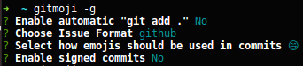

# Sengi Gitflow

The goal of this guide is to explain all steps to accomplish gitflow focusing on the Master/Developer/Code Reviewer role.

## Table of content

- [Requirements](#requirements)
- [Steps](#steps)
  - Master
    1. [Create an empty repository](#create-an-empty-repository)
    1. [Make a first commit](#make-a-first-commit)
    1. [Create branches](#create-branches)
    1. [Protect branches](#protect-branches)
  - Developer
    1. [Configure gitmoji-cli](#configure-gitmoji-cli)
    1. [Clone the repository](#clone-the-repository)
    1. [Create a feature or hotfix branch](#create-a-feature-or-hotfix-branch)
    1. [Add changes to stage](#add-changes-to-stage)
    1. [Make a commit](#make-a-commit)
    1. [Push commits](#push-commits)
    1. [Create MR or PR](#create-mr-or-pr)
    1. [Delete local branch](#delete-local-branch)
  - Code Reviewer
    1. [Review MR or PR](#review-mr-or-pr)

## Requirements

- [Git](https://git-scm.com/)
- [gitmoji-cli](https://github.com/carloscuesta/gitmoji-cli)

## Steps

### Create an empty repository

The Master role creates an empty repo.

### Make a first commit

The Master role creates an empty README.md file and commit to the repo.

### Create branches

The Master role creates two branches: `preproduction` and `production`.

### Protect branches

Protect all branches (`master`, `preproduction` and `production`) from direct merge and push, you should set it up like so:

### Configure gitmoji-cli

The Developer role configure gitmoji-cli.

### Clone the repository

Now the Developer role can clone the repo.

### Create a feature or hotfix branch

The Developer role creates a feature/hotfix branch based from issue code or feature/hotfix name and start writing code.

### Add changes to stage

Once the Developer role finished the feature/hotfix, add changes to stage.

### Make a commit

The Developer role creates a commit using `gitmoji -c`.

### Push commits

The Developer role creates a push to the repo.

### Create MR or PR

The Developer role creates a Merge Request (MR) or Pull Request (PR), assigns to the Code Reviewer role and delete the branch created.

### Review MR or PR

The Code Reviewer role reviews the commit and if everything is ok, he's allowed to merge the feature/hotfix.

### Delete local branch

After the MR/PR is merged, the Developer role should delete the branch and pull down all changes in the `master` branch.

